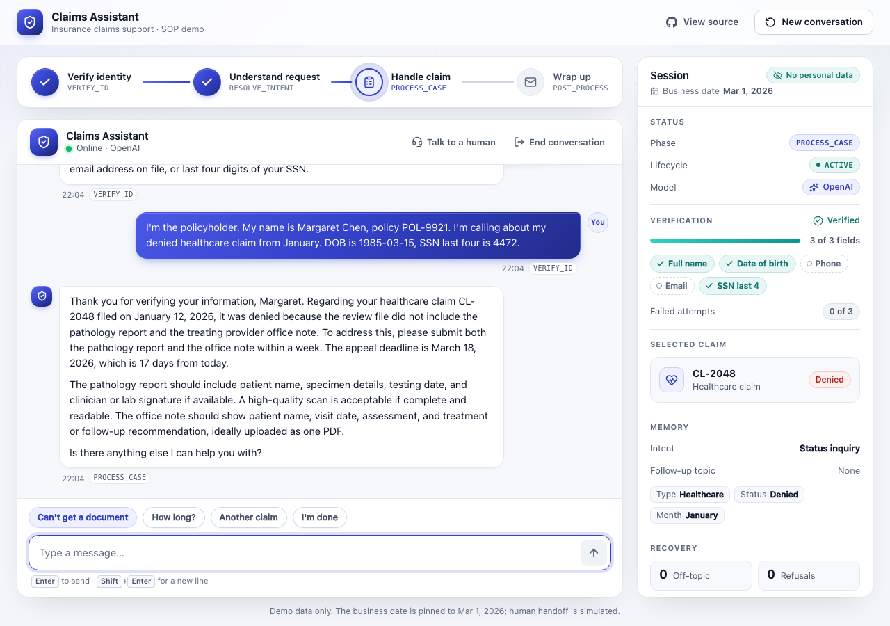
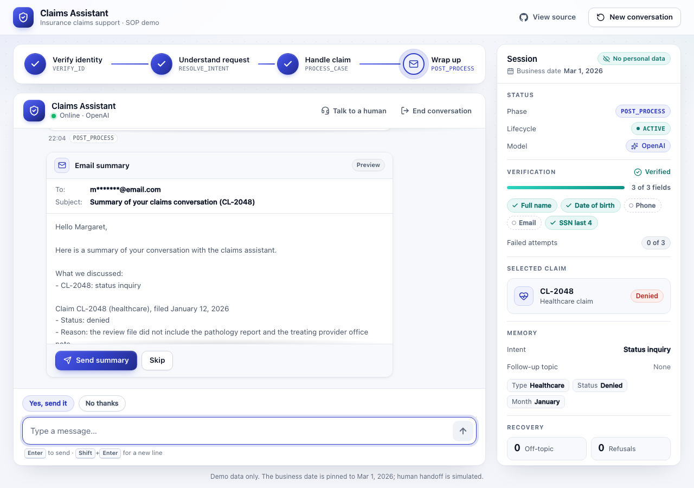

# Claims Assistant: an SOP harness for an insurance claims support agent

A chat agent for insurance claims support that follows a standard operating procedure in four phases. An LLM (OpenAI or Claude, whichever key you provide) reads each message and words each reply. Deterministic code decides everything in between: who the caller is, what they may see, and what happens next.

**Live demo:** https://claims-assistant-4wy7.onrender.com. It runs on Render's free plan: the first visit after 15 idle minutes takes about a minute to wake. Click **Try the demo** under the chat box.

| Phase | What happens | Gate to leave it |
|---|---|---|
| `VERIFY_ID` | Collects identity details. Discloses nothing about claims. Handles partial answers, refusals, clarifying questions and alternate fields. | 3 distinct permitted fields match exactly one policyholder, and no supplied field contradicts that record |
| `RESOLVE_INTENT` | Works out which of the caller's claims they mean, using hints remembered from earlier, e.g. "my denied healthcare claim from January" | Exactly one owned claim selected |
| `PROCESS_CASE` | Answers from the claim record and approved guidance only | Caller is done, or picks another claim |
| `POST_PROCESS` | Shows an email summary and asks the caller to send or skip it | Explicit send or skip. An email only goes out after "send" |

The permitted identity fields are full name, date of birth, phone, email, and the last 4 digits of the SSN. A policy number is not an identity field.

## Run it from GitHub

**Option 1: prebuilt Docker image, nothing to clone.** The image is built by GitHub Actions on every push to `main`, for Intel and Apple Silicon.

```bash
docker run --rm -p 8000:8000 -e OPENAI_API_KEY=sk-... ghcr.io/harshithkoriraj/insurance-claims-sop-harness:latest
```

Open http://localhost:8000. This single container has no mail server, so an approved summary is recorded and the UI says it wasn't delivered. Use Option 3 to see it arrive in an inbox.

**Option 2: GitHub Codespaces, in the browser with no install.**

[](https://codespaces.new/HarshithKoriRaj/insurance-claims-sop-harness)

Add `OPENAI_API_KEY` when Codespaces asks for secrets. It's optional; without it the app runs in offline mode. The app and the Mailpit inbox start automatically on ports 8000 and 8025.

**Option 3: clone and run Docker Compose**, which includes the Mailpit inbox. See the Quick start below.

## Quick start (Docker)

```bash
cp .env.example .env          # set OPENAI_API_KEY (or ANTHROPIC_API_KEY)
docker compose up --build
```

- Chat UI: http://localhost:8000
- Demo inbox for the email summaries (Mailpit): http://localhost:8025
- API docs: http://localhost:8000/api/docs

Without an API key the app still works, in a rule-based offline mode. The inspector panel shows which mode is active (OpenAI, Claude, or Offline rules).





### Try the demo script

Click **Try the demo** under the input box, or paste:

> I'm the policyholder. My name is Margaret Chen, policy POL-9921. I'm calling about my denied healthcare claim from January. DOB is 1985-03-15, SSN last four is 4472.

The assistant:
1. Verifies her from name, date of birth and SSN last 4. The policy number doesn't count.
2. Uses the remembered hint (denied, healthcare, January) to select **CL-2048** without asking again. That rules out her other January claim, CL-2011, which is closed.
3. Explains the denial, the documents needed, and the appeal deadline. The deadline is **17 days** away on the pinned demo date, 2026-03-01.
4. When she's done, offers the summary email with **Send summary** / **Skip**.

Other scenarios worth trying:

| Try | Expected |
|---|---|
| "What is RL?" three times | Polite decline, then an offer of a human, then a (simulated) handoff |
| Wrong SSN three times | Automated verification stops and a human is requested |
| "Why do you need my SSN?" | Explains why, offers the other fields, offers a human on a second refusal |
| `DOB 03/04/1985` | Asks whether that's March 4 or April 3; never guesses |
| Ma Tian (P12) with name, DOB and SSN 6688 | Not verified: that's a national ID, not an SSN. Name, DOB and phone work |
| Verified Margaret asks about CL-3001 | "Couldn't find a claim", the same answer as for a claim that doesn't exist, because CL-3001 belongs to someone else |
| "I'm frustrated…" | The reply acknowledges the feeling first |
| "Talk to a human" | Handoff requested, never shown as "connected" |

## Configuration

Set these in `.env` (see `.env.example`):

| Variable | Default | Meaning |
|---|---|---|
| `OPENAI_API_KEY` | (none) | Enables OpenAI. Read once at startup; never logged or returned by the API |
| `OPENAI_MODEL` | `gpt-4.1-mini` | OpenAI model for interpreting and replying |
| `ANTHROPIC_API_KEY` | (none) | Enables Claude instead |
| `ANTHROPIC_MODEL` | `claude-sonnet-5` | Claude model |
| `LLM_PROVIDER` | (auto) | `openai`, `anthropic` or `offline`. Defaults to whichever key is set |
| `APP_MODE` | `demo` | `demo` pins the business date to 2026-03-01 so the fixture appeal deadlines are still open. `production` uses the real date and rejects overrides |
| `BUSINESS_DATE_OVERRIDE` | (empty) | Demo mode only: `YYYY-MM-DD` or `today` |
| `SESSION_RATE_LIMIT` | `10/600` | New conversations per client per window (count/seconds) |
| `MESSAGE_RATE_LIMIT` | `30/60` | Messages and actions per client per window |

## How it works

```
browser ──► FastAPI ──► ConversationService.interpret ──► LLM (forced function call) → Interpretation → grounded
                    ├─► WorkflowEngine (deterministic) ──► ClaimAccess (owner-scoped), GuidanceLibrary, Mailer
                    └─► ConversationService.respond ─────► LLM (writes from the engine's brief) → reply
```

- **The model proposes; the code decides.** Each turn, the model fills in a strict schema: identity details as stated, intent, claim hints, scope, emotion, and whether the caller wants a human, is refusing, or is choosing to send or skip. The engine validates that and makes every transition. No model output can mark a caller verified, pick another customer's claim, or send an email.
- **Grounding.** An identity value or claim hint the model proposes is kept only if it actually appears in the caller's message. So a model that fills in a year the caller never said, or "completes" an email address, can't steer verification or claim selection. A dropped identity value falls back to the deterministic rule reading of the message.
- **Nothing is disclosed before verification.** Claim lookups need a verified party ID. Before verification the reply brief contains no claim data. As a backstop, any model reply that mentions a claim ID or an amount before verification is discarded and replaced with a template.
- **Only the caller's own claims.** Every lookup is scoped to the verified party. Another customer's case ID and a nonexistent one get the same "couldn't find it" answer.
- **Verification** compares normalized values (NFKC, case, spacing, E.164 phones, ISO dates) against every record and every alias, with no first-match shortcut.
  - A national ID never counts as an SSN.
  - An unclear value (a date that could be day-first or month-first, a phone number that looks mistyped) is asked about again rather than guessed, and doesn't count as a failed attempt.
  - Three failed attempts stop automated matching.
- **Cross-phase memory.** Intent and claim hints given before verification are kept and used as soon as verification succeeds.
- **Consent.** The summary preview is generated by code from the claim record and approved guidance, and shown in full. The email goes only to the address on file, after an explicit Send (button or a clear typed yes to the active offer). Each preview has an ID, so a retry can't send it twice. A new question withdraws the preview.
- **Recovery.**
  - Consecutive off-topic requests: declined, then a human is offered, then handed off (2 and 3, set in `policies/defaults.toml`).
  - Identity refusals: explained, with alternatives offered.
  - Emotions: acknowledged first.
  - Handoff to a human is requested and clearly labelled as simulated.
- **Resilience.** If the model is unavailable, interpretation falls back to rules and replies fall back to templates, so the workflow and its gates still work.
- **Public-demo guards.** Per-client rate limits cap new conversations and messages. That protects the model budget and makes it costly to open fresh sessions just to retry verification. They're in memory and best-effort; a production deployment would add limits at the edge.
- **Sessions** are stored in SQLite with a hashed bearer token and optimistic versioning. After 30 minutes idle, verification expires, the conversation resumes at `VERIFY_ID`, and earlier claim details are hidden.

Code map:

```
services/api/app/
  policies.py, clock.py            versioned policy defaults; business-date clock
  contracts/fixtures.py            strict models for the six fixture files
  claims/                          importer (read-only, cross-checked), documents, guidance, money,
                                   deadlines, access.py (owner-scoped claim tools)
  identity/                        normalize.py, fields.py, verify.py
  workflow/                        state.py, engine.py (phases, gates, transitions)
  conversation/                    claude.py, openai_model.py, interpretation.py (schema + offline rules),
                                   templates.py, service.py (grounding, leak filter, fallbacks)
  summaries/mailer.py              idempotent SMTP sender (Mailpit in Docker)
  main.py, runtime.py, settings.py API, composition root, env settings
apps/web/                          React + Vite chat UI with phase stepper and session inspector
fixtures/                          supplied data, never modified (hash-checked by a test)
policies/                          defaults.toml (thresholds), document_codes.toml (label aliases)
docs/                              architecture plan and milestone plan
```

## Deploying the live demo (Render, free)

[](https://render.com/deploy?repo=https://github.com/HarshithKoriRaj/insurance-claims-sop-harness)

`render.yaml` is a Render Blueprint that runs the published GHCR image on the free plan.

1. Click the button, or in Render choose *New → Blueprint* and pick this repo.
2. Sign in, and enter `OPENAI_API_KEY` when Render asks for it.
3. Apply.

The service appears at `https://claims-assistant-<suffix>.onrender.com`.

Free-plan limits:
- The service sleeps after 15 minutes without traffic. The first request after that takes about a minute.
- Sessions live in `/tmp` and reset when the service restarts.
- To pick up a newer image, use *Manual Deploy → Deploy latest reference*.

`deploy/huggingface/` holds an equivalent Space definition. Docker Spaces now need a Hugging Face PRO subscription.

## Local development

```bash
uv sync
uv run pytest                        # 296 tests; offline, deterministic
set -a; . ./.env; set +a; RUN_LIVE_TESTS=1 uv run pytest tests/live   # 6 live-model scenarios
set -a; . ./.env; set +a             # load the API key into this shell
uv run uvicorn app.main:create_app --factory --app-dir services/api --reload
cd apps/web && npm install && npm run dev      # http://localhost:5173, proxies /api to :8000
```

## Design decisions and known limitations

- **Fixture traps handled:**
  - Policy number isn't an identity field.
  - P12 and P13 hold national IDs.
  - "Yaven Li" is an alias.
  - P9's and P13's phone numbers differ by one digit.
  - Some dates of birth read differently day-first and month-first.
  - Document labels differ from guidance keys.
  - P9 has two January healthcare claims.
  - The appeal deadlines have passed at the real date.

  The demo clock pins the date; `BUSINESS_DATE_OVERRIDE=today` shows the expired case.
- **Representatives:** someone calling on another person's behalf is offered a human rather than being verified. The consent-scenario flow in the fixtures is not automated.
- **Human handoff** is simulated. The session moves to `HANDOFF_PENDING` and never claims a person has joined.
- **Deliberately scoped out for the deadline:**
  - the Jev classifier (designed in `docs/2026-09-28-sop-harness-plan.md` as an optional fast path, with Claude's labels as the fallback);
  - Postgres (SQLite here);
  - a background email worker (sending is in-process and idempotent);
  - claim-data refresh (the fixtures are static).
- The follow-up templates in the supplied guidance are written for plural document lists. The agent keeps approved wording as-is rather than rewriting it.
